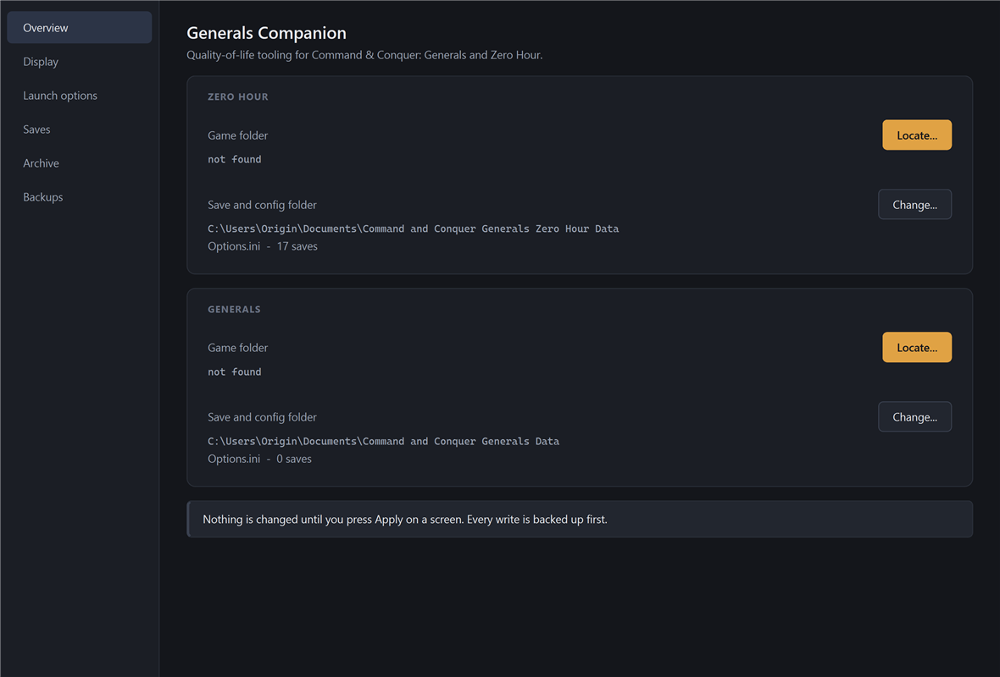
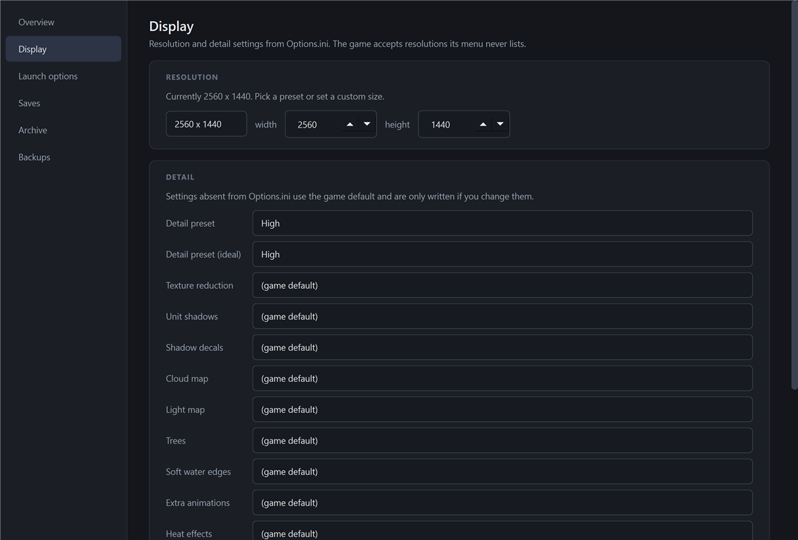
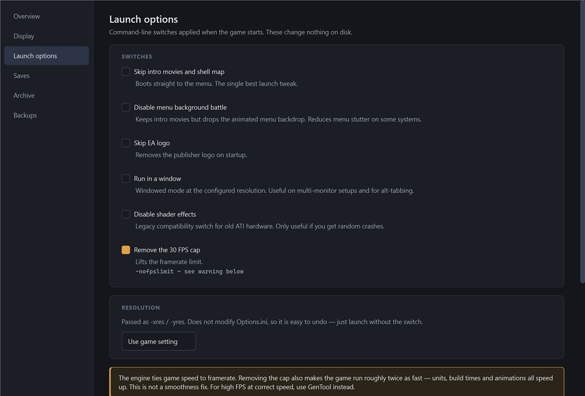
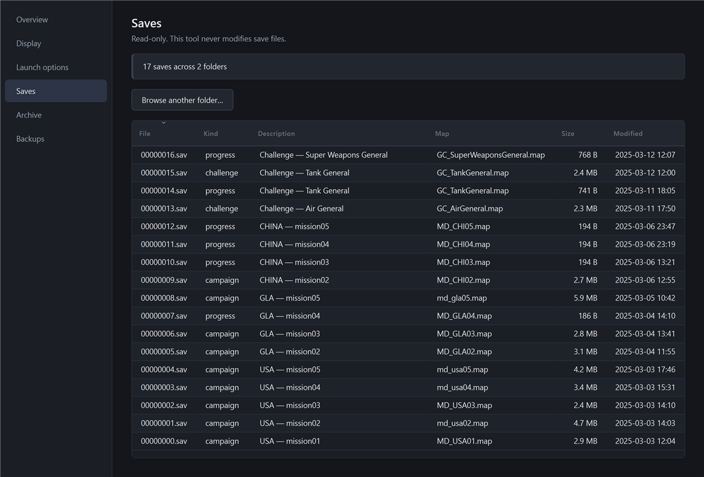
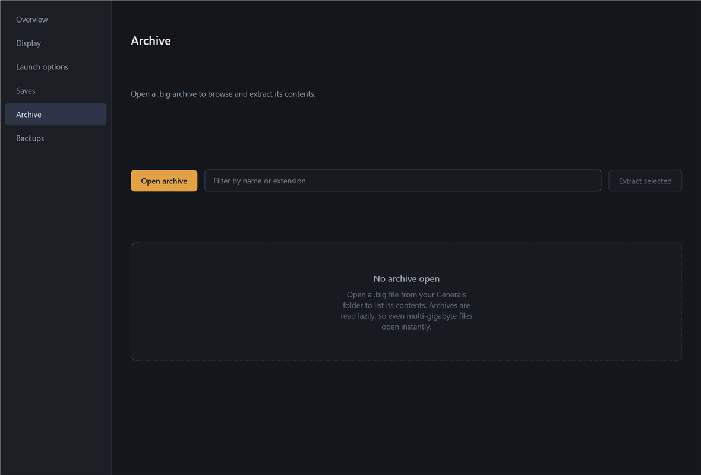

# Generals Companion

A quality-of-life tool and archive editor for **Command &amp; Conquer: Generals** and
**Zero Hour**.

The game is from 2003. It assumes a 4:3 monitor, a single-core CPU, and a machine
that no longer exists. This tool fixes those assumptions by editing the config
files the game already reads &mdash; and backs up everything before it does.

It never patches an executable. It never writes to a save file. It changes
nothing that affects another player.



---

## What it does

| Screen | What it is for |
|---|---|
| **Overview** | Detected installs, config paths and save counts. Every path is correctable. |
| **Display** | Resolution and detail settings from `Options.ini`, including modes the in-game menu never offers. |
| **Launch options** | Command-line switches with a live preview, copy to clipboard, and launch. |
| **Saves** | Read-only browser. Identifies campaign, challenge and progress saves. |
| **Archive** | Open, browse and extract `.big` archives. |
| **Backups** | Every file the tool changed, with one-click restore. |

## Requirements

- Windows 10 or 11
- Command &amp; Conquer: Generals or Zero Hour installed (or just its save folder)

No Python install needed. The release is a single `.exe`.

## Install

Download `GeneralsCompanion.exe` and run it. That is the whole install &mdash; it is
self-contained and writes nothing until you press Apply on a screen.

Settings and backups live in:

```
%LOCALAPPDATA%\GeneralsCompanion\
```

## Quick start

1. **Open the app.** It looks for your installation automatically. If a path shows
   *not found*, press **Locate...** and pick the folder yourself.
2. **Go to Display.** Set your monitor's real resolution and press **Apply changes**.
3. **Go to Launch options.** Tick *Skip intro movies and shell map*, then
   **Copy command line** or **Launch game**.

Full walkthrough: **[docs/TUTORIAL.md](docs/TUTORIAL.md)**

---

## Display

Reads and writes `Options.ini`. The in-game menu offers a short list of 4:3 modes,
but the config file accepts anything &mdash; which is how a 2003 game ends up running
at 2560&times;1440.



Settings that are absent from your `Options.ini` show **(game default)** and are
only written if you change them. Your file only contains keys you have actually
touched, so absence means default, not unsupported.

## Launch options

Command-line switches, applied at launch. These write nothing to disk, so they are
undone by simply launching without them.



| Switch | Effect |
|---|---|
| `-quickstart` | Skips intro movies and the menu background battle. The best one. |
| `-noshellmap` | Keeps intros, drops the animated menu backdrop. |
| `-nologo` | Skips the EA logo. |
| `-win` | Runs in a window. |
| `-noshaders` | Legacy compatibility for old ATI hardware. |
| `-xres` / `-yres` | Sets resolution without touching `Options.ini`. |
| `-nofpslimit` | Lifts the 30 FPS cap. **Read the warning below.** |

### About the FPS cap

`-nofpslimit` does remove the 30 FPS limit. It also makes the game run at roughly
**double speed**, because the engine ties simulation speed to framerate. Units move
faster, buildings finish sooner, animations run fast.

This is not a smoothness fix, and the tool says so the moment you tick it. If you
want high FPS at correct game speed, use [GenTool](https://www.gentool.net/), which
caps frames independently of game logic.

## Saves

A read-only browser. It identifies each save's mission, faction and map, separates
full saves from small campaign-progress markers, and flags anything unreadable.



**This tool never writes to a save file.** There is no edit control and no code path
that opens one for writing. Editing save values is a trainer; this is not that.

You can also browse any folder directly, which is useful for saves copied from
another machine.

## Archive

Opens `.big` archives &mdash; the format Generals uses for its assets. Browse entries,
filter by name or extension, and extract single files or whole selections.



Entries are read lazily, so a multi-gigabyte archive lists instantly and extracting
one file reads only that file. Damaged archives still open: bad entries are skipped
with a warning and the archive is marked read-only so the damage can never be
written back out.

## Backups

Every write is backed up first, and recorded in a journal.

The journal matters more than the backup folder. On restore, scanning a directory
cannot tell a file *this tool* changed from one *you* hand-edited &mdash; and restoring
over the latter would destroy your work. So only journalled files are ever touched.

**Unrecorded means untouched.**

- **Restore selected** puts one file back to a chosen point.
- **Restore everything to stock** returns every file to how it was before this tool
  first ran &mdash; not the previous change, the original state.

Backups are capped at 50, and the first-run baseline is never evicted.

---

## What it will not do

- Patch `generals.exe`, `game.dat` or any executable
- Write to a save file
- Change unit stats, costs, money or tech level
- Anything affecting multiplayer fairness

The rule behind all of it: **fix the machine's assumptions, not the game's rules.**

## Compatibility

| Target | Status |
|---|---|
| Zero Hour 1.04 | Verified |
| Generals 1.08 | Supported |
| GenTool | Not tested; GenTool already handles some display work |
| Generals Online re-release | Not tested |

## Building from source

```
python -m venv .venv
.venv\Scripts\pip install PySide6 pyinstaller psutil
.venv\Scripts\python main.py
```

To produce the executable:

```
.venv\Scripts\pyinstaller GeneralsCompanion.spec --noconfirm
```

Output lands in `dist\GeneralsCompanion.exe`.

## Licence and attribution

Command &amp; Conquer: Generals is a trademark of Electronic Arts. This is an
unofficial community tool and ships no game assets.
